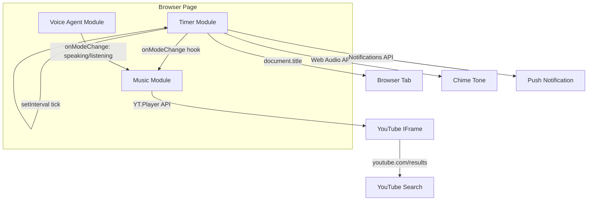

# Design Document: Reading Timer & Ambient Music

## Overview

This feature extends the existing Voice Definition Agent page into a full reading companion. Three clearly separated sections live on a single HTML page:

1. **Timer** — countdown with presets, pause/resume/reset, tab-title sync, and end-of-session notifications.
2. **Music** — YouTube IFrame player with search, volume slider, mute toggle, stop, and auto-duck when the voice agent speaks.
3. **Voice Agent** — the existing ElevenLabs session, unchanged in behaviour.

All new code is purely client-side. No backend routes, no new npm packages, and no build-tool changes are required beyond the existing esbuild pipeline. The YouTube IFrame API is loaded via a `<script>` tag injected at runtime; the Web Audio API is used to synthesise the end-of-session chime without any audio file.



---

## Architecture

### Layered Client-Side Design

The page is structured as three independent, loosely-coupled modules all living inside `public/client.src.js` (and the corresponding HTML in `public/index.html`). Each module owns its own state and exposes a minimal interface to the others.

| Module | State it owns | External interface |
|--------|--------------|-------------------|
| `TimerModule` | `remainingSeconds`, `sessionDuration`, `timerState` (`idle/running/paused`) | `onTimerEnd` callback → calls `MusicModule.fadeOutAndPause()` |
| `MusicModule` | `ytPlayer`, `currentVolume`, `isDucked`, `preduckedVolume` | `duck()`, `unduck()`, `fadeOutAndPause()` |
| `VoiceAgentModule` | `conversation`, `status` | Calls `MusicModule.duck()` / `MusicModule.unduck()` via `onModeChange` |

### Key Design Decisions

- **`setInterval` for countdown**: A 1-second interval decrements `remainingSeconds`. On each tick the display and tab title are updated. The interval handle is stored so it can be cleared on pause/reset. Drift is acceptable for a reading timer (no sub-second precision needed).
- **YouTube IFrame API**: Loaded by injecting `<script src="https://www.youtube.com/iframe_api">` once. The global `window.onYouTubeIframeAPIReady` callback initialises `YT.Player`. Search is performed by setting `player.loadVideoByUrl()` with a `youtube.com/results?search_query=…` URL — this embeds the YouTube search results page directly in the iframe, requiring no API key.
- **Auto-duck via `onModeChange`**: The existing `onModeChange` callback in `client.src.js` already fires with `mode === "speaking"` / `mode === "listening"`. The music module registers a listener; when speaking starts it halves the current volume; when listening resumes it restores the saved pre-duck volume.
- **Chime via Web Audio API**: A short 880 Hz sine wave (0.6 s, fade-out envelope) is synthesised with `AudioContext` + `OscillatorNode`. No audio file is needed.
- **Browser Push Notifications**: Requested lazily on first timer start (not on page load). If denied or unsupported, the feature degrades gracefully — the visual notification and chime still fire.
- **Layout**: The `.container` div is widened to `max-width: 900px` and split into a CSS Grid with three column-cards on desktop, stacking to a single column on narrow viewports (≤ 600 px). Each card has a visible heading and border so sections are easy to identify.

---

## Components and Interfaces

### 1. TimerModule

```javascript
// Internal state
let sessionDuration = 25 * 60;   // seconds, default 25 min
let remainingSeconds = sessionDuration;
let timerState = 'idle';          // 'idle' | 'running' | 'paused'
let intervalHandle = null;

// Public interface
TimerModule.start()
TimerModule.pause()
TimerModule.resume()
TimerModule.reset()
TimerModule.setDuration(minutes)  // validates 1–180
```

On each tick:
1. Decrement `remainingSeconds`.
2. Call `renderCountdown(remainingSeconds)` → updates `#timer-display` and `document.title`.
3. If `remainingSeconds === 0` → call `onTimerEnd()`.

`onTimerEnd()`:
1. Clear interval, set `timerState = 'idle'`.
2. Show `#timer-end-banner`.
3. Play chime (Web Audio API).
4. Fire browser push notification if permission granted.
5. Call `MusicModule.fadeOutAndPause(5000)`.

### 2. MusicModule

```javascript
// Internal state
let ytPlayer = null;              // YT.Player instance
let currentVolume = 50;           // 0–100, mirrors slider
let isDucked = false;
let preduckedVolume = 50;

// Public interface
MusicModule.search(query)         // loads search URL into iframe
MusicModule.setVolume(v)          // 0–100; no-op if isDucked
MusicModule.toggleMute()
MusicModule.stop()
MusicModule.duck()                // called by VoiceAgentModule
MusicModule.unduck()              // called by VoiceAgentModule
MusicModule.fadeOutAndPause(ms)   // called by TimerModule on session end
```

`duck()`: saves `preduckedVolume = currentVolume`, calls `ytPlayer.setVolume(currentVolume * 0.5)`, sets `isDucked = true`.

`unduck()`: calls `ytPlayer.setVolume(preduckedVolume)`, sets `isDucked = false`.

`fadeOutAndPause(ms)`: uses `setInterval` to step volume from current to 0 over `ms` milliseconds, then calls `ytPlayer.pauseVideo()`.

### 3. VoiceAgentModule (modified)

The existing `onModeChange` callback is extended:

```javascript
onModeChange: ({ mode }) => {
  if (mode === 'listening' || mode === 'speaking') setStatus(mode);
  if (mode === 'speaking') MusicModule.duck();
  if (mode === 'listening') MusicModule.unduck();
},
```

No other changes to the voice agent logic.

### 4. HTML Structure

```html
<div class="app-grid">
  <!-- Section 1: Timer -->
  <section class="card" id="timer-section">
    <h2>Reading Timer</h2>
    <div class="preset-buttons">
      <button data-minutes="25">25 min</button>
      <button data-minutes="45">45 min</button>
      <button data-minutes="60">60 min</button>
    </div>
    <div class="custom-duration">
      <input id="custom-minutes" type="number" min="1" max="180" placeholder="Custom (1–180 min)" />
      <span id="custom-error" class="inline-error" hidden></span>
    </div>
    <div id="timer-display" class="countdown">25:00</div>
    <div class="timer-controls">
      <button id="timer-start">Start</button>
      <button id="timer-pause" disabled>Pause</button>
      <button id="timer-reset" disabled>Reset</button>
    </div>
    <div id="timer-end-banner" class="end-banner" hidden>
      Session complete!
    </div>
  </section>

  <!-- Section 2: Music -->
  <section class="card" id="music-section">
    <h2>Ambient Music</h2>
    <div class="search-row">
      <input id="music-search" type="text" placeholder="Search YouTube (e.g. lofi hip hop)" />
      <button id="music-search-btn">Search</button>
      <span id="search-error" class="inline-error" hidden></span>
    </div>
    <div id="yt-player-container">
      <div id="yt-player"></div>
      <div id="yt-error" class="inline-error" hidden></div>
    </div>
    <div class="music-controls">
      <input id="volume-slider" type="range" min="0" max="100" value="50" />
      <button id="mute-btn">Mute</button>
      <button id="stop-btn">Stop</button>
    </div>
  </section>

  <!-- Section 3: Voice Agent -->
  <section class="card" id="agent-section">
    <h2>Voice Agent</h2>
    <!-- existing agent markup moved here unchanged -->
  </section>
</div>
```

---

## Data Models

### TimerState

```typescript
type TimerStatus = 'idle' | 'running' | 'paused';

interface TimerState {
  sessionDuration: number;    // total seconds chosen by user
  remainingSeconds: number;   // seconds left on the clock
  status: TimerStatus;
  intervalHandle: number | null;
}
```

### MusicState

```typescript
interface MusicState {
  ytPlayer: YT.Player | null;
  currentVolume: number;      // 0–100, the user-set level
  isMuted: boolean;
  isDucked: boolean;
  preduckedVolume: number;    // volume saved before duck
  apiReady: boolean;
  apiError: boolean;
}
```

### CountdownDisplay

```typescript
// Pure formatting function — no state
function formatCountdown(totalSeconds: number): string {
  // returns "MM:SS", e.g. 1505 → "25:05"
  const mm = Math.floor(totalSeconds / 60).toString().padStart(2, '0');
  const ss = (totalSeconds % 60).toString().padStart(2, '0');
  return `${mm}:${ss}`;
}
```

### DurationPreset

```typescript
interface DurationPreset {
  label: string;    // "25 min"
  minutes: number;  // 25
}

const PRESETS: DurationPreset[] = [
  { label: '25 min', minutes: 25 },
  { label: '45 min', minutes: 45 },
  { label: '60 min', minutes: 60 },
];
```

---


## Correctness Properties

*A property is a characteristic or behavior that should hold true across all valid executions of a system — essentially, a formal statement about what the system should do. Properties serve as the bridge between human-readable specifications and machine-verifiable correctness guarantees.*

The timer logic and music volume logic are pure (or near-pure) functions with clear input/output behaviour and large input spaces — they are well-suited to property-based testing. UI layout, YouTube IFrame API wiring, browser notification dispatch, and architectural independence are not suitable for PBT and are covered by example-based or smoke tests instead.

### Property 1: Duration validation accepts valid range and rejects invalid range

*For any* integer `d`, `setDuration(d)` SHALL succeed (return no error and set `sessionDuration = d * 60`) if and only if `d` is in the range [1, 180]. For any `d` outside that range, it SHALL return a validation error and leave `sessionDuration` unchanged.

**Validates: Requirements 1.2, 1.3**

---

### Property 2: Countdown format is always valid MM:SS

*For any* non-negative integer `totalSeconds`, `formatCountdown(totalSeconds)` SHALL return a string matching the pattern `\d{2}:\d{2}` where the minutes component equals `Math.floor(totalSeconds / 60)` (zero-padded to 2 digits) and the seconds component equals `totalSeconds % 60` (zero-padded to 2 digits).

**Validates: Requirements 2.2**

---

### Property 3: Countdown decrements by exactly 1 per tick

*For any* valid session duration `d` (in [1, 180] minutes) and any number of elapsed ticks `n` where `n ≤ d * 60`, after starting the timer and advancing `n` ticks, `remainingSeconds` SHALL equal `d * 60 - n`.

**Validates: Requirements 2.1**

---

### Property 4: Pause/resume round-trip preserves remaining time

*For any* timer state with `remainingSeconds = r` and `timerState = 'running'`, calling `pause()` then `resume()` then advancing `n` more ticks SHALL result in `remainingSeconds = r - n`. The pause SHALL have stopped the decrement (no ticks consumed while paused).

**Validates: Requirements 2.4, 2.5**

---

### Property 5: Reset always restores full session duration

*For any* timer state (running, paused, or idle) with any `remainingSeconds` value, calling `reset()` SHALL set `remainingSeconds = sessionDuration` and `timerState = 'idle'`.

**Validates: Requirements 2.6**

---

### Property 6: Tab title always contains the current countdown

*For any* `remainingSeconds` value `r`, after a timer tick that sets `remainingSeconds = r`, `document.title` SHALL contain the string `formatCountdown(r)`.

**Validates: Requirements 2.7**

---

### Property 7: Timer reaches terminal state at zero

*For any* valid session duration `d`, after the timer runs for exactly `d * 60` ticks, `remainingSeconds` SHALL equal `0` and `timerState` SHALL equal `'idle'`.

**Validates: Requirements 3.4**

---

### Property 8: Search URL always encodes the query

*For any* non-empty, non-whitespace search query string `q`, calling `MusicModule.search(q)` SHALL cause the YouTube player to load a URL whose `search_query` parameter contains `q` (URL-encoded as necessary).

**Validates: Requirements 4.2**

---

### Property 9: Empty or whitespace query is always rejected

*For any* string `q` composed entirely of whitespace characters (including the empty string), calling `MusicModule.search(q)` SHALL NOT invoke the player load function and SHALL set the search error message to a non-empty string.

**Validates: Requirements 4.4**

---

### Property 10: Volume setter always applies the given level

*For any* integer `v` in [0, 100], calling `MusicModule.setVolume(v)` when the player is not ducked SHALL call `ytPlayer.setVolume(v)` and set `currentVolume = v`.

**Validates: Requirements 5.2**

---

### Property 11: Mute/unmute round-trip preserves volume level

*For any* volume level `v` in [0, 100], calling `toggleMute()` (to mute) then `toggleMute()` (to unmute) SHALL result in `ytPlayer.setVolume` being called with `v` on unmute, and the volume slider position SHALL remain at `v` throughout.

**Validates: Requirements 5.3**

---

### Property 12: Duck/unduck round-trip restores pre-duck volume

*For any* current volume `v` in [0, 100], calling `duck()` SHALL call `ytPlayer.setVolume(Math.round(v * 0.5))` and save `preduckedVolume = v`. Subsequently calling `unduck()` SHALL call `ytPlayer.setVolume(v)`, restoring the original level.

**Validates: Requirements 6.1, 6.2**

---

### Property 13: Volume slider is blocked while ducked

*For any* volume `v` in [0, 100], while `isDucked = true`, calling `setVolume(v)` SHALL update `currentVolume = v` (so the slider position is remembered) but SHALL NOT call `ytPlayer.setVolume(v)` — the player volume SHALL remain at the ducked level.

**Validates: Requirements 6.3**

---

## Error Handling

### Timer Errors

| Scenario | Behaviour |
|----------|-----------|
| Custom duration < 1 or > 180 | Show inline error below input; disable Start button; do not modify `sessionDuration` |
| Custom duration is non-numeric | Treat as invalid; same as out-of-range |
| `setInterval` not available (very old browser) | Degrade gracefully — show static "Timer unavailable" message |

### Music / YouTube Errors

| Scenario | Behaviour |
|----------|-----------|
| YouTube IFrame API script fails to load | Show error in `#yt-error`; timer and voice agent continue unaffected |
| `YT.Player` constructor throws | Catch, show error in `#yt-error`; set `apiError = true` |
| Search query is empty or whitespace | Show inline error in `#search-error`; do not call player |
| `ytPlayer` is null when duck/unduck/stop called | Guard with `if (!ytPlayer) return;` — no-op |
| `fadeOutAndPause` called when player not playing | Guard with player state check; skip fade if not playing |

### Notification Errors

| Scenario | Behaviour |
|----------|-----------|
| `Notification` API not supported | Skip push notification; chime and visual banner still fire |
| User denies notification permission | Skip push notification; chime and visual banner still fire |
| `Notification` constructor throws | Catch silently; chime and visual banner still fire |

### Voice Agent Errors

No changes to existing error handling. The `onModeChange` extension is wrapped in a null-guard so that if `MusicModule` is not yet initialised, the duck/unduck calls are no-ops.

---

## Testing Strategy

### PBT Library

Use [fast-check](https://github.com/dubzzz/fast-check) (already compatible with the existing Jest setup). Each property test runs a minimum of **100 iterations** (`numRuns: 100`).

Tag format for each property test:
```
// Feature: reading-timer-music, Property N: <property text>
```

### Unit Tests (example-based)

Focus on specific scenarios, UI interactions, and integration points between modules.

**TimerModule:**
- Preset buttons set the correct `sessionDuration` (25, 45, 60 min).
- Starting the timer transitions `timerState` from `'idle'` to `'running'`.
- End-of-session banner is shown when `remainingSeconds` reaches 0.
- `AudioContext` oscillator is created and started on `onTimerEnd`.
- `Notification` constructor is called when permission is `'granted'`.
- `MusicModule.fadeOutAndPause(5000)` is called on `onTimerEnd`.

**MusicModule:**
- `onYouTubeIframeAPIReady` initialises `YT.Player` with the correct container ID.
- `stop()` calls `ytPlayer.pauseVideo()` and `ytPlayer.seekTo(0)`.
- `duck()` is a no-op when `ytPlayer` is null.
- API load failure shows `#yt-error` and does not throw.

**VoiceAgentModule integration:**
- `onModeChange({ mode: 'speaking' })` calls `MusicModule.duck()`.
- `onModeChange({ mode: 'listening' })` calls `MusicModule.unduck()`.
- `duck()` is a no-op when player is not playing.

**Layout:**
- All three section elements (`#timer-section`, `#music-section`, `#agent-section`) exist in the DOM.

### Property-Based Tests

```javascript
// Feature: reading-timer-music, Property 1: duration validation
fc.assert(fc.property(
  fc.integer({ min: -1000, max: 1000 }),
  (d) => {
    const result = TimerModule.setDuration(d);
    if (d >= 1 && d <= 180) {
      expect(result.ok).toBe(true);
      expect(TimerModule.getState().sessionDuration).toBe(d * 60);
    } else {
      expect(result.ok).toBe(false);
    }
  }
), { numRuns: 100 });

// Feature: reading-timer-music, Property 2: countdown format
fc.assert(fc.property(
  fc.nat({ max: 10800 }),  // 0–180 min in seconds
  (totalSeconds) => {
    const s = formatCountdown(totalSeconds);
    expect(s).toMatch(/^\d{2}:\d{2}$/);
    const [mm, ss] = s.split(':').map(Number);
    expect(mm).toBe(Math.floor(totalSeconds / 60));
    expect(ss).toBe(totalSeconds % 60);
  }
), { numRuns: 100 });

// Feature: reading-timer-music, Property 3: countdown tick accuracy
fc.assert(fc.property(
  fc.integer({ min: 1, max: 180 }),
  fc.nat(),
  (durationMinutes, extraTicks) => {
    const totalSeconds = durationMinutes * 60;
    const n = extraTicks % totalSeconds;
    TimerModule.setDuration(durationMinutes);
    TimerModule.start();
    advanceTicks(n);  // test helper that fires the interval callback n times
    expect(TimerModule.getState().remainingSeconds).toBe(totalSeconds - n);
  }
), { numRuns: 100 });

// Feature: reading-timer-music, Property 4: pause/resume round-trip
fc.assert(fc.property(
  fc.integer({ min: 1, max: 10800 }),
  fc.nat({ max: 20 }),
  (startingSeconds, ticksAfterResume) => {
    TimerModule._setState({ remainingSeconds: startingSeconds, timerState: 'running' });
    TimerModule.pause();
    advanceTicks(5);  // these should not decrement
    TimerModule.resume();
    advanceTicks(ticksAfterResume);
    expect(TimerModule.getState().remainingSeconds).toBe(startingSeconds - ticksAfterResume);
  }
), { numRuns: 100 });

// Feature: reading-timer-music, Property 5: reset restores session duration
fc.assert(fc.property(
  fc.integer({ min: 1, max: 180 }),
  fc.integer({ min: 0, max: 10800 }),
  fc.constantFrom('idle', 'running', 'paused'),
  (durationMinutes, remaining, state) => {
    TimerModule.setDuration(durationMinutes);
    TimerModule._setState({ remainingSeconds: remaining, timerState: state });
    TimerModule.reset();
    const s = TimerModule.getState();
    expect(s.remainingSeconds).toBe(durationMinutes * 60);
    expect(s.timerState).toBe('idle');
  }
), { numRuns: 100 });

// Feature: reading-timer-music, Property 12: duck/unduck round-trip
fc.assert(fc.property(
  fc.integer({ min: 0, max: 100 }),
  (volume) => {
    MusicModule._setState({ currentVolume: volume, isDucked: false });
    MusicModule.duck();
    expect(mockYtPlayer.lastVolume).toBe(Math.round(volume * 0.5));
    MusicModule.unduck();
    expect(mockYtPlayer.lastVolume).toBe(volume);
  }
), { numRuns: 100 });
```

### Integration Tests

- Full page load: all three sections render, YouTube API script tag is injected.
- Timer runs to zero: end banner visible, chime fired, `fadeOutAndPause` called.
- Voice agent speaking → music ducks; voice agent listening → music restores.

### What Is Not Tested Programmatically

- Visual distinction between sections (subjective layout review).
- Responsive layout at 320 px (manual or visual regression test).
- Audio quality of the Web Audio chime (subjective).
- YouTube search result relevance (external service behaviour).
- Browser push notification delivery (OS-level behaviour).
