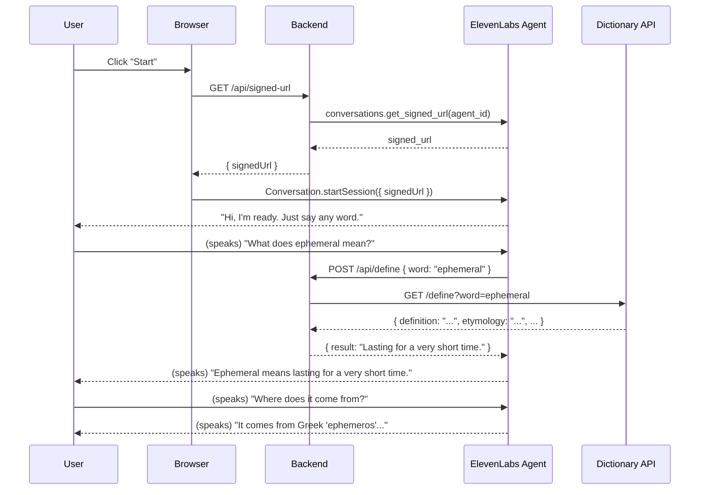

# Design Document: Voice Definition Agent

## Overview

The Voice Definition Agent is a browser-based, hands-free dictionary assistant powered by ElevenLabs Conversational AI. A reader speaks a word aloud; the agent transcribes it, fetches an accurate definition via a webhook, and speaks the answer back — all within a few seconds. Follow-up questions (etymology, pronunciation, usage) are handled conversationally without re-stating the word.

The system has three runtime components:

1. **Browser client** — a minimal HTML/JS page that embeds the ElevenLabs `@elevenlabs/client` SDK and renders a single activation button.
2. **Backend server** — a lightweight Node.js (or Python) HTTP server with two responsibilities: issuing signed session URLs to the browser, and serving the dictionary webhook endpoint that the agent calls.
3. **ElevenLabs Conversational AI agent** — configured once via the ElevenLabs API; handles STT (Scribe), LLM reasoning, TTS (Flash), turn-taking, and tool dispatch.



---

## Architecture

### Component Responsibilities

| Component | Technology | Responsibility |
|-----------|-----------|----------------|
| Browser client | HTML + `@elevenlabs/client` | Microphone capture, session lifecycle, UI state |
| Backend server | Node.js / Express (or Python / FastAPI) | Signed URL issuance, dictionary webhook, API key protection |
| ElevenLabs Agent | ElevenLabs Conversational AI | STT, LLM, TTS, VAD, tool dispatch, session management |
| Dictionary API | Free Dictionary API (or equivalent) | Authoritative word definitions, etymology, examples |

### Key Design Decisions

- **Signed URL auth**: The ElevenLabs API key never reaches the browser. The backend mints a short-lived signed URL per session, which the browser uses to open the WebSocket connection.
- **Webhook for definitions**: The agent is configured with a webhook tool pointing at the backend `/api/define` endpoint. This prevents the LLM from hallucinating definitions — all definitions come from a real dictionary source.
- **Server VAD**: Turn-taking uses `server_vad` mode with a 500 ms silence threshold, matching the requirement for hands-free, no-button-press operation.
- **Flash TTS model**: `eleven_flash_v2_5` is used for TTS to minimize response latency.
- **Stateless backend**: The backend holds no session state. All conversational context lives inside the ElevenLabs agent session.

---

## Components and Interfaces

### 1. Browser Client (`index.html` + `client.js`)

Responsibilities:
- Render a single "Start / Stop" toggle button.
- On start: fetch a signed URL from the backend, then call `Conversation.startSession()`.
- On stop: call `conversation.endSession()`.
- Request microphone permission before starting.
- Display a status indicator (idle / listening / speaking / error).
- Show a text fallback if microphone permission is denied.

Key SDK usage:

```javascript
import { Conversation } from "@elevenlabs/client";

const conversation = await Conversation.startSession({
  signedUrl: signedUrl,           // obtained from backend
  onConnect: () => setStatus("listening"),
  onDisconnect: () => setStatus("idle"),
  onError: (err) => setStatus("error: " + err.message),
  onModeChange: ({ mode }) => setStatus(mode), // "listening" | "speaking"
});
```

### 2. Backend Server

#### `GET /api/signed-url`

Issues a signed session URL for the configured agent.

```
Response: { "signedUrl": "wss://..." }
```

Implementation (Node.js):

```javascript
app.get("/api/signed-url", async (req, res) => {
  const result = await elevenlabs.conversationalAi.conversations.getSignedUrl({
    agentId: process.env.AGENT_ID,
  });
  res.json({ signedUrl: result.signedUrl });
});
```

#### `POST /api/define`

Receives a tool call from the ElevenLabs agent and returns a definition.

Request body (sent by ElevenLabs):
```json
{
  "tool_call_id": "call_abc123",
  "tool_name": "define_word",
  "parameters": { "word": "ephemeral" },
  "conversation_id": "conv_xyz"
}
```

Response:
```json
{
  "result": "Ephemeral: lasting for a very short time. (Origin: Greek 'ephemeros', meaning 'daily'.)"
}
```

The backend fetches from the Free Dictionary API (`https://api.dictionaryapi.dev/api/v2/entries/en/{word}`) and formats the result into a single readable string for the agent.

### 3. ElevenLabs Agent Configuration

The agent is created once and its ID stored in the backend environment. Configuration:

```javascript
const agent = await elevenlabs.conversationalAi.agents.create({
  name: "Voice Definition Agent",
  conversationConfig: {
    agent: {
      firstMessage: "Hi, I'm ready. Just say any word you'd like defined.",
      language: "en",
      maxTokensAgentResponse: 300,
    },
    tts: {
      voiceId: "JBFqnCBsd6RMkjVDRZzb",   // Rachel — calm, clear narration
      modelId: "eleven_flash_v2_5",
      stability: 0.6,
      similarityBoost: 0.75,
      optimizeStreamingLatency: 3,
    },
    asr: {
      modelId: "scribe_v2_realtime",
    },
    turn: {
      mode: "server_vad",
      silenceThresholdMs: 500,
      interruptSensitivity: 0.5,
    },
  },
  prompt: {
    prompt: `You are a calm, concise dictionary assistant for readers.
When a user says a word or asks what a word means, call the define_word tool immediately.
Use the returned definition to give a single-sentence spoken answer.
Do not add extra commentary unless the user asks a follow-up question.
For follow-up questions about etymology, pronunciation, or usage examples, answer from the tool result.
When the user says goodbye, stop, or exit, end the call using the end_call tool.
Keep all responses under 2 sentences unless the user explicitly asks for more detail.`,
    llm: "gpt-4o-mini",
    temperature: 0.3,
    toolsStrictMode: true,
  },
  tools: [
    {
      type: "webhook",
      name: "define_word",
      description: "Look up the definition, etymology, and usage example for a word. Call this whenever the user asks about a word's meaning, origin, or pronunciation.",
      webhook: {
        url: `${process.env.BACKEND_URL}/api/define`,
        method: "POST",
      },
      parameters: {
        type: "object",
        properties: {
          word: {
            type: "string",
            description: "The word to define, in its base form (e.g. 'ephemeral', not 'ephemerally')",
          },
        },
        required: ["word"],
      },
    },
    {
      type: "system",
      name: "end_call",
    },
  ],
});
```

---

## Data Models

### `DefinitionRequest`

Sent by ElevenLabs to the backend webhook:

```typescript
interface DefinitionRequest {
  tool_call_id: string;
  tool_name: "define_word";
  parameters: {
    word: string;
  };
  conversation_id: string;
}
```

### `DefinitionResponse`

Returned by the backend to ElevenLabs:

```typescript
interface DefinitionResponse {
  result: string;  // Human-readable string the agent will use to compose its spoken reply
}
```

### `DictionaryEntry`

Internal model populated from the Free Dictionary API response:

```typescript
interface DictionaryEntry {
  word: string;
  definition: string;       // First definition from the first meaning
  partOfSpeech: string;     // e.g. "adjective"
  etymology: string | null; // Origin info if available
  example: string | null;   // Usage example if available
  phonetic: string | null;  // Phonetic spelling e.g. "/ɪˈfɛm.ər.əl/"
}
```

### `SessionState` (browser-only, in-memory)

```typescript
type SessionStatus = "idle" | "connecting" | "listening" | "speaking" | "error";

interface SessionState {
  status: SessionStatus;
  errorMessage: string | null;
  conversation: Conversation | null;
}
```

### Agent Configuration Shape

```typescript
interface AgentVoiceConfig {
  voiceId: string;
  modelId: "eleven_flash_v2_5";
  stability: number;          // 0.5–0.7 per requirements
  similarityBoost: number;
  optimizeStreamingLatency: number;
}

interface AgentTurnConfig {
  mode: "server_vad";
  silenceThresholdMs: 500;    // per requirements
  interruptSensitivity: number;
}
```

---


## Correctness Properties

*A property is a characteristic or behavior that should hold true across all valid executions of a system — essentially, a formal statement about what the system should do. Properties serve as the bridge between human-readable specifications and machine-verifiable correctness guarantees.*

The core logic of this feature that is amenable to property-based testing is the **dictionary webhook** (`POST /api/define`). This is a pure-ish function: given a word string, it fetches from an external API and formats a result string. The input space (any word string) is large, the behavior varies meaningfully with input, and 100 iterations will surface edge cases (empty strings, special characters, multi-word phrases, words not in the dictionary). The ElevenLabs agent configuration, TTS/STT behavior, and browser UI are not suitable for PBT — they are infrastructure, configuration, or qualitative requirements.

### Property 1: Webhook returns a result for any valid word

*For any* non-empty word string, a POST to `/api/define` with that word as the parameter SHALL return a JSON object with a non-empty `result` string field.

**Validates: Requirements 3.1, 3.4**

### Property 2: Webhook handles unknown words gracefully

*For any* word string that is not found in the dictionary data source, the `/api/define` endpoint SHALL return a `result` string that communicates the word was not found — it SHALL NOT throw an unhandled error or return an empty result.

**Validates: Requirements 3.3**

### Property 3: Webhook result includes all available dictionary data

*For any* word that exists in the dictionary and has etymology and/or usage example data, the `result` string returned by `/api/define` SHALL include that data (definition, etymology when present, example when present) so the agent can answer follow-up questions without a second lookup.

**Validates: Requirements 4.2, 4.4**

---

## Error Handling

### Webhook Errors

| Scenario | Backend behavior | Agent behavior |
|----------|-----------------|----------------|
| Dictionary API returns 404 (word not found) | Return `{ result: "I couldn't find a definition for '[word]'. Could you check the spelling?" }` | Agent reads the result string aloud |
| Dictionary API returns 5xx or network timeout | Return `{ result: "The dictionary service is temporarily unavailable. Please try again in a moment." }` | Agent reads the result string aloud |
| `word` parameter is missing or empty | Return HTTP 400 with `{ error: "word parameter is required" }` | Agent prompt instructs it to always provide the word; this is a defensive guard |

### Browser / Session Errors

| Scenario | Client behavior |
|----------|----------------|
| Microphone permission denied | Display static text: "Microphone access is required to use the Voice Definition Agent." |
| Signed URL fetch fails (backend unreachable) | Display: "Could not connect to the server. Please try again." |
| WebSocket disconnects mid-session | Update status to "disconnected"; show a "Reconnect" button |
| `Conversation.startSession()` throws | Catch error, display message, reset to idle state |

### Agent Prompt Error Handling

The system prompt instructs the agent to:
- Ask the user to repeat if the input was unclear.
- Use the `define_word` tool result verbatim for definitions — never invent definitions.
- End the call gracefully when the user signals they are done.

---

## Testing Strategy

### Unit Tests (example-based)

Focus on the backend webhook logic and browser client state transitions.

**Backend (`/api/define`):**
- Returns a formatted result string for a known word (e.g., "ephemeral").
- Returns a "not found" result string for an unknown word.
- Returns HTTP 400 when the `word` parameter is missing.
- Correctly extracts `definition`, `etymology`, and `example` from a mock dictionary API response.
- Handles a dictionary API timeout without crashing.

**Browser client:**
- Does not call `startSession` on page load.
- Calls `GET /api/signed-url` before calling `startSession`.
- Displays the microphone-denied error message when permission is refused.
- Transitions status correctly: idle → connecting → listening → speaking → idle.

**Agent configuration:**
- Agent config object has `turn.mode === "server_vad"`.
- Agent config has `turn.silenceThresholdMs === 500`.
- Agent config has `tts.modelId === "eleven_flash_v2_5"`.
- Agent config has `tts.stability` between 0.5 and 0.7.
- Agent tools array includes a `system` tool named `end_call`.
- Agent tools array includes a `webhook` tool named `define_word`.

### Property-Based Tests

Use [fast-check](https://github.com/dubzzz/fast-check) (JavaScript) or [hypothesis](https://hypothesis.readthedocs.io/) (Python) depending on the backend language. Each property test runs a minimum of **100 iterations**.

**Property 1 — Webhook returns a result for any valid word**
```
// Tag: Feature: voice-definition-agent, Property 1: webhook returns result for any valid word
fc.assert(fc.asyncProperty(
  fc.string({ minLength: 1, maxLength: 50 }).filter(s => s.trim().length > 0),
  async (word) => {
    const res = await request(app).post("/api/define").send({ word });
    expect(res.status).toBe(200);
    expect(typeof res.body.result).toBe("string");
    expect(res.body.result.length).toBeGreaterThan(0);
  }
), { numRuns: 100 });
```

**Property 2 — Webhook handles unknown words gracefully**
```
// Tag: Feature: voice-definition-agent, Property 2: webhook handles unknown words gracefully
// Use generated nonsense strings unlikely to be real words
fc.assert(fc.asyncProperty(
  fc.stringMatching(/^[a-z]{15,30}$/),  // long random lowercase strings
  async (word) => {
    const res = await request(app).post("/api/define").send({ word });
    expect(res.status).toBe(200);
    expect(typeof res.body.result).toBe("string");
    expect(res.body.result.length).toBeGreaterThan(0);
    // Must not be an empty or undefined result
  }
), { numRuns: 100 });
```

**Property 3 — Webhook result includes all available dictionary data**
```
// Tag: Feature: voice-definition-agent, Property 3: webhook result includes all available data
// Use a mock dictionary API that returns varying combinations of definition/etymology/example
fc.assert(fc.asyncProperty(
  fc.record({
    word: fc.string({ minLength: 1 }),
    hasEtymology: fc.boolean(),
    hasExample: fc.boolean(),
  }),
  async ({ word, hasEtymology, hasExample }) => {
    mockDictionaryApi.returns({ word, definition: "test def",
      etymology: hasEtymology ? "from Latin" : null,
      example: hasExample ? "used in a sentence" : null });
    const res = await request(app).post("/api/define").send({ word });
    if (hasEtymology) expect(res.body.result).toContain("Latin");
    if (hasExample) expect(res.body.result).toContain("sentence");
  }
), { numRuns: 100 });
```

### Integration Tests

- Full session flow: browser connects → speaks a word → agent calls webhook → agent speaks definition. (Requires ElevenLabs test credentials and a running backend.)
- Session context: after defining a word, a follow-up question about etymology is answered without re-stating the word.
- Session termination: saying "goodbye" ends the session cleanly.

### What Is Not Tested Programmatically

- TTS audio quality and naturalness (subjective).
- Response latency under 3 seconds (requires live ElevenLabs infrastructure).
- VAD accuracy at exactly 500 ms silence (ElevenLabs internal behavior).
- Pronunciation clarity (subjective TTS output).
